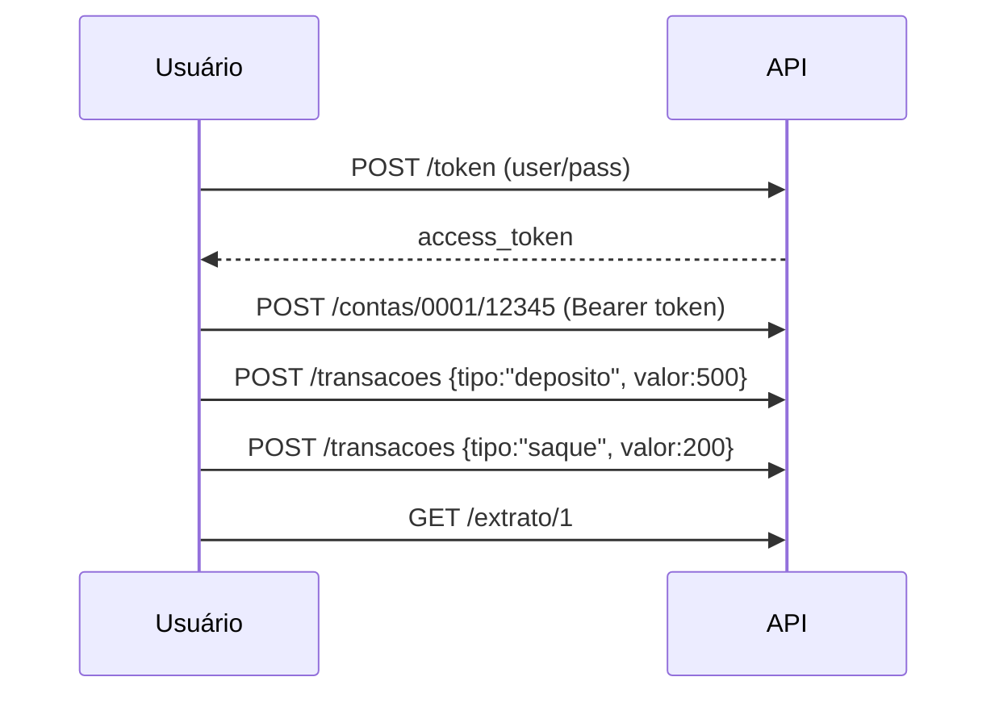

# API Bancária Assíncrona com FastAPI 

API RESTful assíncrona para gerenciamento de **contas correntes** e **transações bancárias** (depósitos/saques), desenvolvida para o desafio da DIO - Trilhas Python.

## Funcionalidades

-  **Autenticação JWT** - Endpoints protegidos
-  **CRUD Assíncrono** - SQLAlchemy + SQLite async
-  **Validação de Negócio** - Saldo insuficiente, valores negativos
-  **Documentação OpenAPI** - Swagger UI automático
-  **Migrações Alembic** - Gerenciamento de schema
-  **Extrato Completo** - Histórico de transações por conta

##  Como Executar

### 1. Clonar/Preparar Projeto
```bash
git clone <seu-repo>
cd api_bancaria_async
```

### 2. Ambiente Virtual + Dependências
```bash
python -m venv .venv
# Windows
.\.venv\Scripts\Activate.ps1
# Linux/Mac
source .venv/bin/activate

pip install -r requirements.txt
```

### 3. Migrações Banco
```bash
alembic upgrade head
```

### 4. Rodar Servidor
```bash
uvicorn main:app --reload --host 0.0.0.0 --port 8000
```

### 5. Testar API
Acesse http://127.0.0.1:8000/docs

## 🧪 Teste Rápido



**Credenciais padrão:**
```
username: user
password: pass
```

## 📋 Endpoints

| Método | Endpoint | Autenticação | Descrição |
|--------|----------|--------------|-----------|
| `POST` | `/token` | Não | Gerar JWT token |
| `POST` | `/contas/{agencia}/{numero}` | Sim | Criar conta |
| `POST` | `/transacoes` | Sim | Depósito/Saque |
| `GET` | `/extrato/{conta_id}` | Sim | Extrato completo |

## 🏗️ Estrutura do Projeto

```
api_bancaria_async/
├── alembic/           # Migrações banco
├── models/            # SQLAlchemy models
│   └── models.py
├── alembic.ini        # Config Alembic
├── main.py           # FastAPI app
├── requirements.txt  # Dependências
└── app.db           # SQLite banco
```

## 📦 Dependências (requirements.txt)

```txt
fastapi==0.115.0
uvicorn[standard]==0.30.6
sqlalchemy[asyncio]==2.0.35
aiosqlite==0.20.0
alembic==1.13.2
python-jose[cryptography]==3.3.0
passlib[bcrypt]==1.7.4
python-multipart==0.0.9
pydantic[email-validator]==2.9.2
```

##  Validações Implementadas

-  Valor transação > 0
-  Saldo suficiente para saques
-  Conta existe para transações
-  JWT token válido
-  Agencia/numero únicos

##  Scripts Úteis

```bash
# Ativar venv (Windows)
.\.venv\Scripts\Activate.ps1

# Novas migrações
alembic revision --autogenerate -m "nome_migracao"

# Reset banco (desenvolvimento)
rm app.db
alembic upgrade head

# Testes automáticos
uvicorn main:app --reload
```

##  Modelos de Dados

```python
class Account:
    id: int
    agencia: str     # ex: "0001"
    numero: str      # ex: "12345678"
    saldo: float

class Transaction:
    id: int
    conta_id: int
    tipo: TipoTransacao  # "deposito" | "saque"
    valor: float
    data: datetime
```


Feito com ❤️ para DIO Bootcamp Backend Python - LuizaLabs
